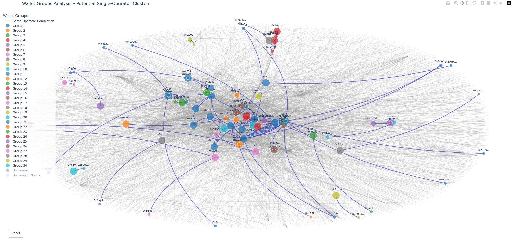

# Mintegrity - blockchain transaction analysis toolkit

Most Web3 users juggle multiple wallets across different protocols and services. 
Our analytics connect these fragmented identities by analyzing on-chain behavior patterns, giving you an insight into your true audience.

Are whales driving most of your volume? Which other protocols are popular among your users? What does your typical user's portfolio look like?

Stop guessing what your community wants. With Mintegrity's user analysis, you'll understand who you're serving - and create products that resonate with their actual needs.

## Features
Mintegrity is a toolkit for analyzing ETH blockchain transaction data, including direct wallet interactions, contract interactions, and interactions among popular tokens.
It enables users to build, visualize, and analyze transaction graphs to gain insights into blockchain networks and identify patterns of behavior.

- **Transaction Graph Building**: Create transaction graphs from blockchain data, using both direct wallet interactions and contract interactions
- **Graph Visualization**: Generate interactive visualizations of transaction networks
- **Node Categorization**: Categorize all addresses in the graph based on heuristics
- **Wallet Grouping**: Group related wallets based on transaction patterns

## Installation

1. Clone this repository
2. Create a virtual environment using venv
3. Install dependencies using requirements.txt
4. Create a `.env` file with ALCHEMY_API_KEY (or set it as system environment variable)

## Usage Examples
The `cases\rocketpool` directory contains complete examples demonstrating how to use the framework based on the [Rocket Pool](https://rocketpool.net/) smart contracts.

## Project Structure
- **scripts\\**: Core functionality
  - **commons\\**: Common utilities and models
  - **graph\\**: Graph-related functionality
    - **analysis\\**: Analytical tools
    - **building\\**: Graph building
    - **categorization\\**: Node categorization
    - **model\\**: Data models
    - **optimization\\**: Graph optimization
    - **visualization\\**: Graph visualization
- **cases\\**: Example use cases
  - **rocketpool\\**: Rocket Pool analysis examples

## Costs
> **Note:** Data collection for 1 popular contract for 365 days consumes only 2-3% of the Alchemy free quota, which corresponds to approximately $1 in value. Usage in your use case depends on the number of contract interactions and the time period you analyze.

## Contributing
Contributions are welcome! Please feel free to submit a Pull Request.

## License

This project is licensed under the terms of the license included in the repository.
